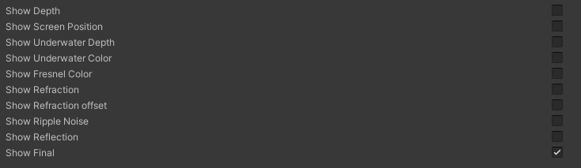
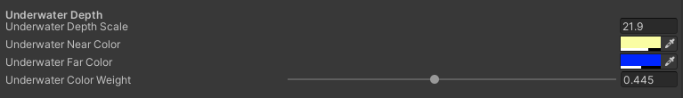
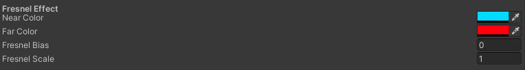
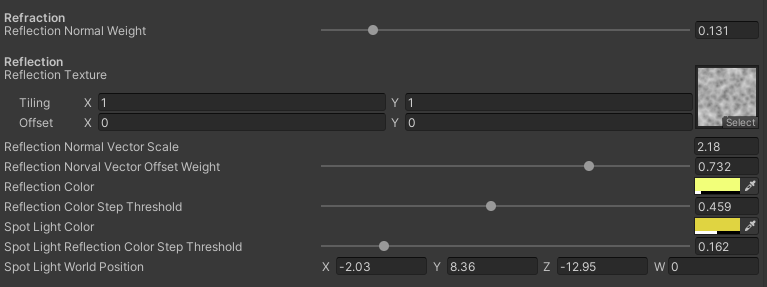
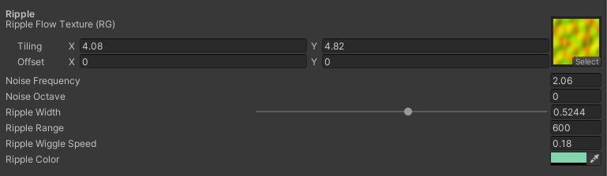
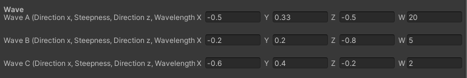

# Water Surface Shader
> in Unity's URP pipeline!
> Make sure to enable depth texture and opaque texture!

## Parameters:

* `Show Depth/Screen Position/Underwater Depth/.../Final`: Toggle each to show individual features that make up this feature. **Toggle Show Final to show the complete shader**.

* `Underwater Depth Scale`: controls how deep you want to see objects beneath the water surface.
* `Underwater Near/Far Color`: The colour tinted to underwater objects. Use alpha channels to control the level of objects' original colour. Near colour is tinted to objects that are close to the water surface, and the Far Color is the counterpart.
* `Underwater Color Weight`: The weight to mix between Underwater Color and the colour controlled by the Fresnel effect.

* `Near/Far Color`: The colours that tint near and far fields.
Fresnel Bias/Scale: The bias and scale of the Fresnel effect. Just don't touch it (?)

The underwater refraction is controlled by the x and z components of normal vectors. 

* `Refraction Normal Weight`: Controls the degree of refraction affected by normal vectors.
* `Reflection Normal Vector Scale`: Show fine/coarse reflection pattern.
* `Reflection Normal Vector Offset Scal`e: How smooth/rough the reflection be.
* `Reflection Color Step Threshold`: Control the area of the reflection pattern.
* `Spot Light World Position`: The world position of a spotlight. For now, it only supports one spotlight.

Ripple only shows up near objects.
* `Ripple Flow Texture`: Control the flow of ripples.
* `Ripple Frequency/Octave`: How dense you want the ripple to be.
* `Ripple Width`: Control the width of ripples:
* `Ripple Range`: Control the area of ripples.
* `Ripple Wiggle Speed`: Control the distortion speed of ripples.

* `Wave`: Wave motion is controlled by three Trochoid waves: Wave A/B/C
* `Steepness` controls the amplitude of each wave. The sum of the steepness of three waves should not be greater than 1.0, or you'll get funny artifacts.